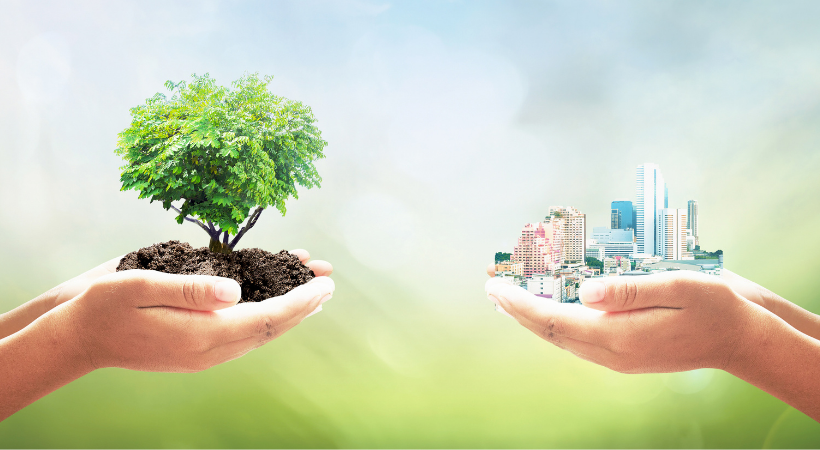
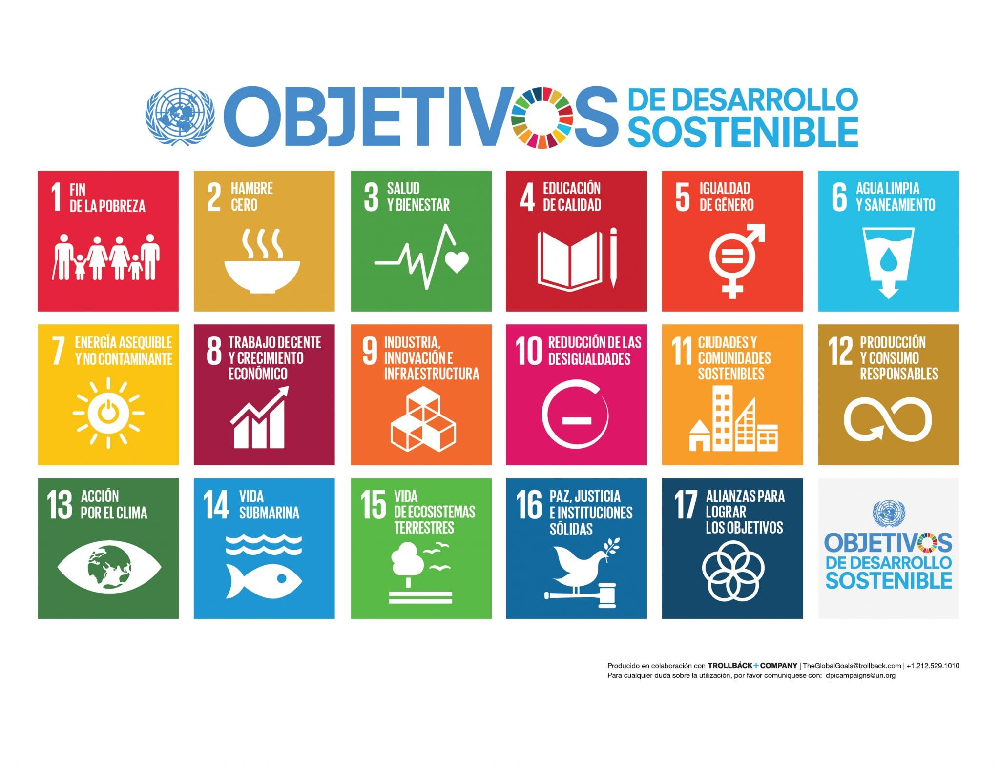
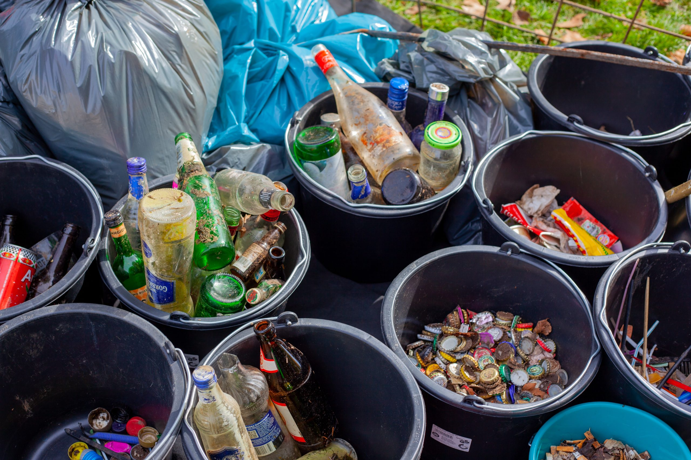
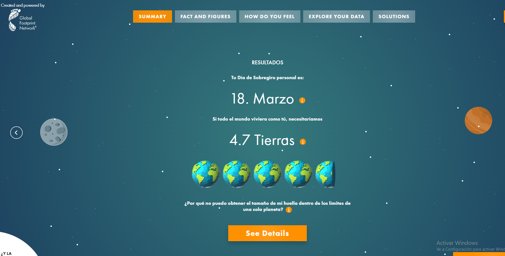
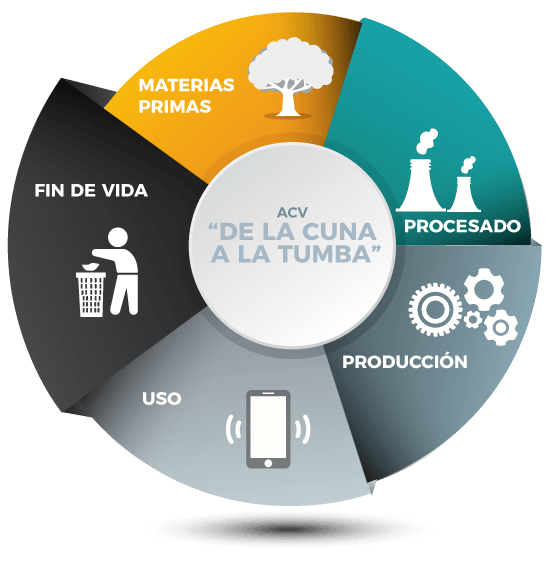

### 23/01/2026
Plan de Sostenibilidad Empresarial:

En la clase de hoy analizamos cómo las empresas integran la sostenibilidad dentro de su estrategia. Se destacó que la sostenibilidad no es solo una opción, sino una condición de supervivencia, ya que las empresas dependen directamente de ecosistemas sanos, recursos naturales y de la confianza de la sociedad.

Se estudió la estructura de un plan de sostenibilidad, que consta de varias fases:
- Diagnóstico inicial, para conocer la situación real de la empresa.
- Identificación de los grupos de interés, como empleados, clientes, proveedores o la sociedad.
- Análisis de materialidad, para priorizar los impactos más relevantes.
- Definición de acciones y métricas, donde se establecen objetivos concretos.

Vimos la importancia de los Indicadorse (KPIs) lo que no se mide no mejora, y como se agrupan en las tres dimension de la sostenibilidad: ambiental, social y gobernanza.

Pregunta: Un plan de sostenibilidad tiene una utilidad real o es un greenwashing?

Desde mi punto de vista, un plan de sostenibilidad sí tiene una utilidad real, pero solo si se aplica de forma honesta y medible. Cuando el plan incluye objetivos claros, KPIs reales y un seguimiento continuo, se convierte en una herramienta muy útil para mejorar el impacto ambiental y social de la empresa, además de fortalecer su viabilidad a largo plazo.

### 16/1/2026
Agenda 2030 y los Objetivos de Desarrollo Sostenible:

En clase se ha trabajado la Agenda 2030 y los Objetivos de Desarrollo Sostenible (ODS), un conjunto de 17 objetivos aprobados por la ONU con el fin de mejorar la calidad de vida de las personas y proteger el planeta antes del año 2030.

Se analizó cómo surgió la Agenda 2030, como respuesta a problemas globales como la pobreza, la desigualdad, el cambio climático y la falta de acceso a derechos básicos.

Vimos los distintos objetivos de la agenda, y los comentamos de forma general y como se agrupa en tres dimensiones fundamentales:
- Social (Personas): bienestar, educación, salud e igualdad.
- Ambiental (Planeta): protección del medio ambiente y uso responsable de los recursos.
- Económica y de gobernanza (Prosperidad y Paz): crecimiento económico sostenible, instituciones sólidas y cooperación internacional.

Cada ODS se integra dentro de una o varias de estas dimensiones.

Reflexión Personal:
- Los ODS son necesarios porque ayudan a concienciar sobre problemas globales. Lo importante no es solo tener los objetivos, sino convertirlos en acciones reales y adaptadas a la realidad de cada país y de cada persona. Aunque los ODS tienen una intención positiva, también existen argumentos en contra que invitan a una reflexión crítica.

Pregunta: Si crees que se van a conseguir los objetivos de desarrollo sostenible?
- En mi opinión, no se van a conseguir todos los Objetivos de Desarrollo Sostenible tal y como están planteados para 2030, aunque sí se lograrán avances parciales en algunos de ellos.

### 9/1/2026
Contaminación y Residuos (Huella digital y física).
La contanimación que nos rodea y el impacto de la tecnologia (e-waste).

Hablamos sobre qué se considera residuo y cómo esta percepción varía según la persona y el contexto, destacando la importancia de la reutilización y el reciclaje antes de desechar un objeto.

También se habló del problema global de la basura electrónica, ya que muchos países desarrollados envían sus residuos a países subdesarrollados, donde se extraen materiales valiosos como oro.

También comentamos el impacto de ciertos residuos en los sistemas naturales y urbanos, como el caso de las toallitas húmedas, que provocan grandes atascos en las alcantarillas.

Hablamos un poco de las hormonas y como afectan nuestro cuerpo.

Además, se mencionó cómo algunos residuos y contaminantes causan desastres ambientales por tirar residuos al agua, como incendios, espumas tóxicas y la contaminación de ríos y mares.

Reflexión Personal:
- Esta clase me ha hecho reflexionar sobre lo poco conscientes que somos del impacto real de nuestros residuos, especialmente los tecnológicos. Muchas veces cambiamos de móvil u ordenador sin pensar en lo que ocurre después con esos dispositivos.

Pregunta: ¿Por qué cambiaste de tu ultimo movil?
- Porque la bateria se estropeo y no cargaba más, ademas ya tenia cierta edad el móvil y decidi que era hora de cambiarlo.

## Enero 2026

### 12/12/2025
En el dia de hoy hablaremos del Cambio Climático: El Multiplicador de Amenazas.

Impactos sistémicos en la economia, tecnologia y seguridad global:

Comentamos como afecta el cambio climatico, como a cualquier variable modificado por el puede provacar amenazas (como la guerra por recursos)

Evidencia del cambio climatico:
- Aumento temperatura.
- Eventos extremos (olas de calor, incendios).
- Deshielo y Nivel del Mar.

El codigo fuente de la crisis: Emisiones de Gases de Efecto Invernadero (Energia, transporte, etc.).

Como impacta en la salud humana.

Impacto de agua, alimentos y migraciones, por alteración de la produccion agricola, aumento de precios, migraciones forzadas.

Analisis de los Riesgos y Costes, mas vale invertir dinero que no invertir.

Geopolítica Climatica: La Carrera por los Recursos del Futuro, como los paises compiten por los distintos recursos disponibles.

Posibles maneras de Mitigar el cambio climatico; energias renovables, eficiencia energetica, economia circular, etc.

Pregunta: ¿Cuál es el principal emisor de CO2?
- Son las actividades de los seres humanos, como por ejemplo la quema de combustibles fosiles para la generación de energia. 

Pregunta 2: ¿Que puedo hacer yo como programador para mitigar el cambio climatico?
- Buscar formas de optimizar y reducir el consumo de energia usado, por ejemplo optimizando un sistema antiguo que usa bastante energia.

### 05/12/2025
En la clase de hoy hablaremos del siguiente tema:
¿Cuanto "pesas" en el planeta? Huella Ecológica y de Carbono.

Huella Ecológica:
- Demanda vs Oferta: Comparar lo que consumimos contra lo que la Tierra pueda regenerar

Huella de Carbono:
Es el subconjunto mas critico de la huella ecologica, representa el 60% del impacto total.

El total de gases de efecto invernadero emitidos directa o indirectamente.

Vemos una línea del tiempo en como durante los años a seguido aumentando nuestra huella ecológica y de carbono.

Estrategias para Mitigar esto:
- Reducir el consumo (hardware, movilidad, consumo mas responsable).
- Eficiencia (Green Coding).
- Compensar (reforestacion).

Pregunta:

## Diciembre

### 28/11/2025
Economia Lineal vs Circular:

Hablamos de lo que son la economia lineal y circular, cuales son sus ventajas y una guia de como es su modelo sostenible.

Modelo actual de la economia lineal: "Tomar, Hacer, Desechar"
Es unidireccional y tiene un flujo: Extraccion - Produccion - Consumo - Residuo.
Consecuencias del modelo lineal: Impacto Insostenible.
Genera demasiado residuos que el reciclaje industrial no puede absorber.

Economia circular: Cerrando los Ciclos.
Principios Clave de Circularidad: Ecodiseño, Prioridad: Reutilizacion y reparacion, Integracion Ecosistema.
Busca maximizar el valor de los productos y recursos manteniéndolos en uso el mayor tiempo posible, a través de la reutilización, reparación, refabricación y reciclaje para minimizar la generación de residuo.

La Economia Verde es un modelo de desarrollo que busca la prosperidad económica y social sin dañar el medio ambiente.

Pregunta:
¿Y a mi que me cuentas? ¿Enfoque colectivo o individual?

Enfoque colectivo tiene objetivos que son prioritarios y las decisiones se toman de manera cooperativa, buscando el beneficio común. En mi opinion es necesario una cooperacion comun minima para que la economia mejore.

### 21/11/2025
Falto el profesor

### 14/11/2025
El viaje oculto del producto.
Nosotros fabricamos cosas/herramientas para facilitarnos la vida y vivir mejor.

Hablamos de lo que es el peso oculto y como nos permite comparar distintos productos, de lo que puede pesar un producto y el peso que tardo en fabricarlo.

Hablar de los diferentes tipos de energia que existen: solar, geologica, hidroelectrica, etc.

Economia Lineal: extraer, fabricar, consumir y desechar = modelo de sentido unico.

Economia Circular: reducir, reutilizar y reciclar = imita a la naturaleza.

Analisis del ciclo de vida: Metodologia para evaluar el impacto ambiental total de un producto.
1. Materias primas (extraccion recursos de la tierra).
2. Fabricacion (proceso industrial, ensamblaje y embalaje).
3. Distribución (transporte del producto).
4. Uso (la vida del producto en el consumidor).
5. Gestión Final (Desecho del producto: reciclaje o reutilización).

 ### Elige un paso del ciclo de la vida que explique un ejemplo de un producto lo que experimenta en ese paso:
Aplicado a una Rejilla metalica:

### 1. Materias primas Usadas:
- Acero
  - Se usa acero laminado en frío o caliente.
  - Cantidad típica: 1–3 kg para una rejilla doméstica / 5–15 kg para una rejilla industrial.

- Aluminio (si es más ligera)

    - Cantidad: 0,5–2 kg.

- Tratamientos:

    - Zinc (galvanizado): 20–600 gramos de zinc, según tipo.

    - Pintura en polvo o anticorrosión: 10–50 gramos.

- Proceso de fabricación:

    - Corte del metal (láser, cizalla).

    - Conformado (plegado, perforado, estampado).

    - Soldadura (si son barras metálicas).

    - Tratamiento térmico (para resistencia).

    - Galvanizado o pintado.

- Impactos del proceso:

    - Consumo de electricidad: 0,3–1,5 kWh por unidad.

    - Emisiones por uso de hornos: CO₂ indirecto.

    - Residuos: Retales de metal: 5–20 % del material (normalmente reciclable).
### 2. Ensamblaje

No todas las rejillas requieren ensamblaje. Algunas salen de fábrica como una sola pieza.

- Si requiere ensamblaje:

    - Unión de marco + rejilla interior.

    - Remaches metálicos: 1–10 unidades (2–20 g).

    - Tornillos: 2–6 unidades (5–25 g).

- Materiales adicionales:

    - Soldadura adicional: 2–10 g de material de aporte.

- Impactos principales:

    - Consumo energético leve: 0,1–0,3 kWh.

    - Emisiones indirectas por soldadura (si la hay).

    - Residuos: mínimos.

### 3. Embalaje

El ACV también evalúa el material adicional necesario para el envío.

Materiales típicos usados:

- Cartón:

    - Entre 10 y 150 g según tamaño.

- Plástico protector (PE):

    - Entre 5 y 20 g.

- Etiquetas adhesivas:

    - 1–3 g.

- Palés (solo en grandes cargas):

    - Se contabiliza parcialmente por unidad.

- Impacto:

    - Incrementa las emisiones del transporte y residuos.

    - El cartón es reciclable, pero su producción consume agua y energía.

### 07/11/2025
No ha venido el profesor.

## Noviembre

### 31/10/2025
Hablamos como la tierra es un sistema finito y sus recursos limitados.
Los recursos son limitados por su consumo creciente y desafio de satisfacer necesidades actuales.
Ciclo cerrado de la biosfera, en nuestro sistema finito todos los residuos se convierten en recursos, no existe un afuera donde tirar lo que sobra.
Hablamos tambien del ciclo del agua, de donde sale y como la obtenemos, ademas de las tres dimensiones de la sostenibilidad: economia, sociedad y medio ambiente.

### 24/10/2025
Hemos hablado de las Estrategias de Crecimiento r y k (especie oportunista r - especie en equilibrio k).
- Estrategia k crecimiento lento pero en entorno estable.
- Estrategia r crecimiento rapido.

Estrategia r y k son diferentes patrones del crecimiento de la poblacional y su impacto en los ecosistemas naturales.

Pregunta: ¿Que estrategia usamos los humanos?
Usamos los dos, pero somos mas de la estrategia k, pero hubo momentos en la historia que hemos sido mas de la estrategia r y paises que estan mas cerca de la r que la k.

### 17/10/2025
Hoy hablamos de las relaciones entre especies y la forma que nos adaptamos con las personas que vivimos con (mascotas, personas, seres vivos).
Vimos las relaciones intraespecificas e interespecificas entre los distintos seres vivos.
Los seres humanos tambien formamos parte del ecosistema, nuestras relacion entre nosotros intraespecificas e interespecificas, nuestras formas de supervivencia, etc.

Pregunta: ¿Que hacemos nosotros: cooperamos o competimos?
Hacemos las dos cosas, depende de que nos referimos cooperaremos o competiremos, o las dos cosas a la vez.
Por ejemplo en un partido de futbol los dos equipos cooperan para organizar todo el partido y el cuando van a jugar, pero compiten a la hora de jugar.

### 10/10/2025
Hoy hemos visto los conceptos clave sobre limites ambientales: la capacidad de carga y su relevancia para la humanidad. Vemos la importancia de la capacidad de carga, de cual es el maximo de individuos que un ecosistema puede aguantar. Algunas cosas que hemos visto sobre el tema:
1. Curvas de crecimiento, comentamos las consecuencias si dejamos crecer sin control.
2. Como nos hacen pelearnos por la disponibilidad de recursos esenciales y limitantes.
3. Ejemplos de limites superados como la deforestacion extrema, pesca excesiva, etc.

Pregunta: ¿Hay un limite para la poblacion humana?

Si, pero desconocemos ese limite, solo sabemos que el mundo no se extiende infinitamente entonces debe existir un limite.

## Octubre

### 03/10/2025 
Comentar como los humanos somos animales ya que hacemos las distintas funciones vitales: nutricion, reproducion, relacion. Hablamos de como nos diferenciamos de los animales aunque estamos construidas de las mismas piezas, los que nos diferencia son capacidades unicas: lenguaje complejo, tecnologia avanzada, cultura transmisible, etc. Y al final comentamos de si los humanos podriamos acabar con la vida en nuestro planeta. Pregunta: Acabaremos con la vida en nuestro planeta?. En mi opinion tarde o temprano seremos responsables de acabar la vida en la tierra ya sea despues de guerras nucleares o causando cambios en nuestro medio ambiente que destrozen nuestro ecosistema.

### 26/09/2025 
Tema 1 visto de Sostenibilidad, comentar, hablar y opinar sobre la sostenibilidad, su definicion y funciones. Como afecta la sostenibilidad en el mundo que vivimos.

### 19/09/2025 
Primer dia de Clase, introduccion a los criterios de evaluación/calificación

## Septiembre
